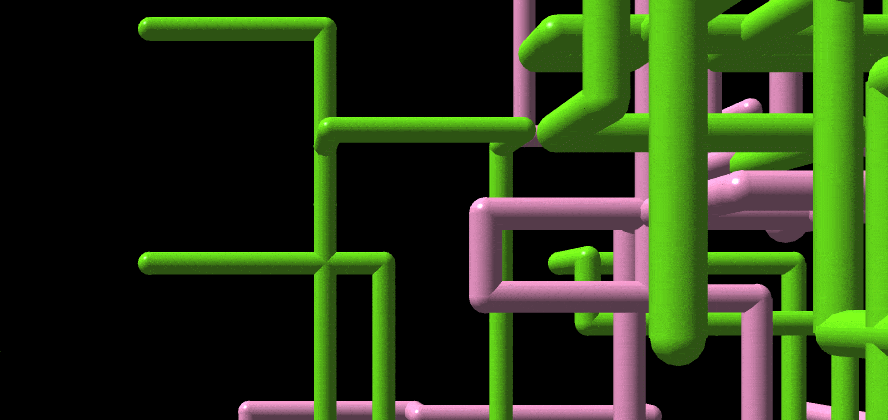

# [ Pipes](https://1j01.github.io/pipes/)

A web-based remake of the Windows 3D Pipes screensaver (3D Pipes.scr or sspipes.scr) using [Three.js](https://threejs.org/)

Includes both [Utah Teapots](https://en.wikipedia.org/wiki/Utah_teapot) and candy cane easter eggs! (with increased chances 😏)

[Check it out!](https://1j01.github.io/pipes/)

It's also included in [98.js.org](https://98.js.org/) as a program you can run.

(This screen capture GIF is outdated. It now avoids collisions between pipes and implements the dissolve effect for fading out.)

## TODO

- Add back smooth fade out as an option, now that a dissolve effect is implemented

- Add control for speed

- Animate sections into existence, emulating CPU graphics where the triangles were drawn progressively and the screen updated in between "frames" (optionally)

- Improve lighting (the original was less shiny), or at least avoid unflattering camera angles

- Use a palette (what palette? please help with this)

- Extra camera functions like continuous rotation, maybe even following the pipes like a rollercoaster

- Allow moving camera during dissolve transition (it's kinda unpleasant how it stops you (abruptly), and the effect is implemented as an overlay anyways)

- Save options to local storage, or maybe in the URL

- Custom textures with drag and drop (and also a file input)
  (can accept multiple textures, for it to choose from randomly (pulling from a bag and not replacing them))

- Proper elbow joints (currently uses a sphere (smaller than the ball joint so it doesn't stick out) rather than a section of a torus);
  could use [spline extrusion](https://threejs.org/examples/#webgl_geometry_extrude_splines) rather than trying to align a torus section every which way (if it actually helps)

- Implement different behavioral characteristics between pipes

- Follow-the-leader mode

- Update README GIF

- An API maybe?

## See Also

##### Mine / Affiliated

- [98.js: a recreation of the Windows 98 desktop](https://github.com/1j01/98)

- [NW Screensaver: a platform for running web pages as screensavers](https://github.com/1j01/nw-screensaver)

##### Unaffiliated

- [Screensaver Subterfuge: a game set in the 3D maze screensaver](https://poor-track-design.itch.io/screensaver-subterfuge)

## License

MIT-licensed; see [LICENSE](LICENSE) for details

## Development

### Live Server

You just need an HTTP server, but [Live Server](https://www.npmjs.com/package/live-server) is a great option, automatically reloading when you make changes.

### Prettier

[Prettier](https://prettier.io/) is used for code formatting.

To set up, including a pre-commit hook:

- Install [Node.js](https://nodejs.org/) if you don't already have it
- Run `npm i` in the project directory

A pre-commit hook can be surprising tho; formatting on save might be better...

### Reference Material

The source code for the original OpenGL screensavers can be found in [a version of the Windows SDK (for Windows NT 4.0)](https://winworldpc.com/download/3d03c2ad-c2ad-18c3-9a11-c3a4e284a2ef), in `MSTOOLS\SAMPLES\OPENGL\SCRSAVE`

(If you have a later version of the code, please let me know.)

### Project Structure

All the good stuff is in `screensaver.js`
